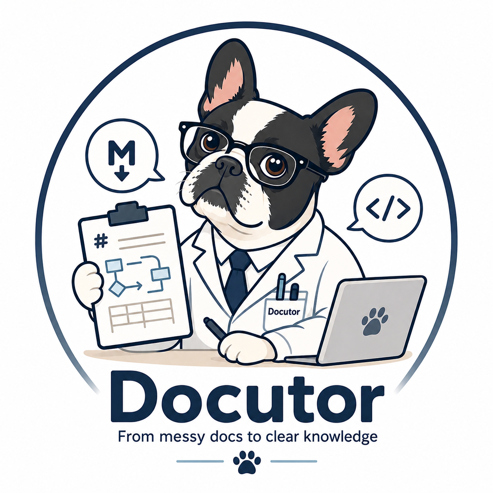
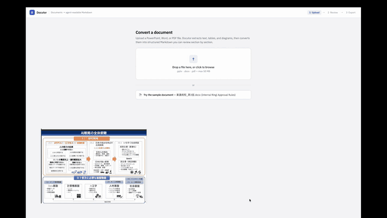

# Docutor MVP

<p align="center">
  
</p>

Docutor converts messy enterprise documents into clean, agent-readable Markdown.

The target users are traditional Japanese companies with important specifications,
workflows, and business rules trapped in PowerPoint, Word, PDF, and
diagram-heavy documents.

Docutor is not intended to be a simple OCR or file conversion tool. The goal is
to transform unstructured business documents into structured knowledge assets
that both humans and AI agents can inspect, correct, and use.

## Product Demo

[](docs/assets/how-docutor-works.mp4)

[Watch with sound and full resolution](docs/assets/how-docutor-works.mp4)

## Getting Started

### Prerequisites

- **Node.js >= 22.13** — the repo pins `22.22.0` in `.nvmrc`; run `nvm use` if you use nvm.
- **pnpm 11.7.0**, managed via Corepack (bundled with Node). Run `corepack enable` once if `pnpm` isn't resolving to the pinned version.
- **Python 3** with `pdfplumber` and `Pillow` for document extraction:

  ```bash
  pip install pdfplumber Pillow
  ```

- **Poppler utilities** (`pdftoppm`, `pdfinfo`, `pdftotext`) for PDF text and page-image extraction:

  ```bash
  brew install poppler   # macOS
  ```

- **LibreOffice** (`soffice` on your `PATH`) for rendering DOCX/PPTX pages to images:

  ```bash
  brew install --cask libreoffice   # macOS
  ```

- An **OpenAI API key** if you want real conversions — the `mock` provider works without one.

### Setup

```bash
git clone https://github.com/EitaroY/Docutor.git
cd Docutor
nvm use              # optional, matches the Node version pinned in .nvmrc
pnpm install
cp sample.env.local .env.local
```

Open `.env.local` and set `OPENAI_API_KEY` (or leave `DOCUTOR_LLM_PROVIDER=mock` to run without one).

```bash
pnpm dev
```

Then open [http://localhost:3000](http://localhost:3000).

### Useful scripts

- `pnpm dev` — start the Next.js dev server
- `pnpm build` — production build
- `pnpm lint` — run ESLint
- `pnpm test` — run the Vitest unit test suite

## Core Product Flow

1. Upload a PowerPoint, Word, PDF, or diagram-heavy business document.
2. Extract text, images, tables, and diagram candidates.
3. Convert extracted content into structured Markdown sections.
4. Review each generated section.
5. Compare original diagram captures with generated Mermaid or draw.io output.
6. Edit diagram code when needed and preview the result.
7. Accept reviewed sections.
8. Complete the review.
9. Export the final Markdown file and related assets.

## MVP Scope

The MVP prioritizes the review experience over perfect document parsing.

Required capabilities:

- File upload
- Mock conversion pipeline
- Review screen
- Reviewable section list
- Markdown editor and preview
- Diagram comparison UI
- Mermaid code editing and preview
- Complete action
- Markdown export
- ZIP export with related assets

Office and PDF parsing can initially be partial or mocked, but the architecture
must allow real parsers and LLM/VLM providers to be added later.

## Product Principle

Diagram conversion should be human-in-the-loop by design.

LLM/VLM output will often be imperfect, especially for arrows, grouping, layout,
branching, and ambiguous relationships. The key workflow is therefore:

- Show the original diagram image.
- Show the generated Mermaid or draw.io representation.
- Allow users to edit the generated code.
- Preview the updated diagram.
- Accept, reject, or regenerate the section.

For diagrams, Docutor prioritizes semantic correctness over pixel-perfect layout:

- Node labels
- Arrow direction
- Relationships
- Branching conditions
- Grouping
- Hierarchy
- Workflow order

## Suggested Stack

- TypeScript
- Next.js
- React
- Tailwind CSS
- shadcn/ui where useful
- Mermaid.js
- Node.js / Next.js API routes

draw.io support may start as a placeholder, but the diagram interface should be
designed so a diagrams.net viewer or editor can be integrated later.

## Data Model

Documents are made of reviewable sections.

```ts
type SectionType =
  | "heading"
  | "paragraph"
  | "table"
  | "diagram"
  | "image"
  | "requirement"
  | "note";

type ReviewStatus = "pending" | "accepted" | "rejected" | "regenerating";

type ReviewSection = {
  id: string;
  type: SectionType;
  title: string;
  sourcePage: number;
  originalText?: string;
  sourceImage?: string;
  generatedMarkdown: string;
  reviewStatus: ReviewStatus;
};

type DiagramSection = ReviewSection & {
  type: "diagram";
  sourceImage: string;
  format: "mermaid" | "drawio";
  generatedCode: string;
};
```

## Conversion Modes

Docutor supports two conversion modes:

- `mock`: Works without API keys and returns a sample converted document.
- `real`: Uses a provider interface so OpenAI, Anthropic, Gemini, or another
  provider can be swapped in later.

The app should not be hard-coded around one LLM provider.

## Conversion Rules

When converting documents:

- Preserve the original meaning.
- Do not invent missing rules.
- Do not silently fill gaps.
- Mark unclear content as `TODO:` or `Unclear:`.
- Structure content for AI agents.
- Separate business rules, requirements, constraints, exceptions, and workflows.
- Convert tables into Markdown tables.
- Convert simple diagrams into Mermaid.
- Use draw.io-compatible structures for diagrams that Mermaid cannot represent
  well.

## Planned Screens

1. Upload screen
2. Review screen
3. Diagram review component
4. Complete / export screen

The UI should feel like a calm enterprise SaaS tool: quiet, structured, and easy
to scan during repeated review work.

## Completion Criteria

The MVP is complete when a user can:

1. Upload a file.
2. Get a converted mock document.
3. Review generated sections.
4. Compare an original diagram image with a generated Mermaid diagram.
5. Edit the Mermaid code.
6. Preview the updated diagram.
7. Accept the section.
8. Click Complete.
9. Download the final Markdown.
